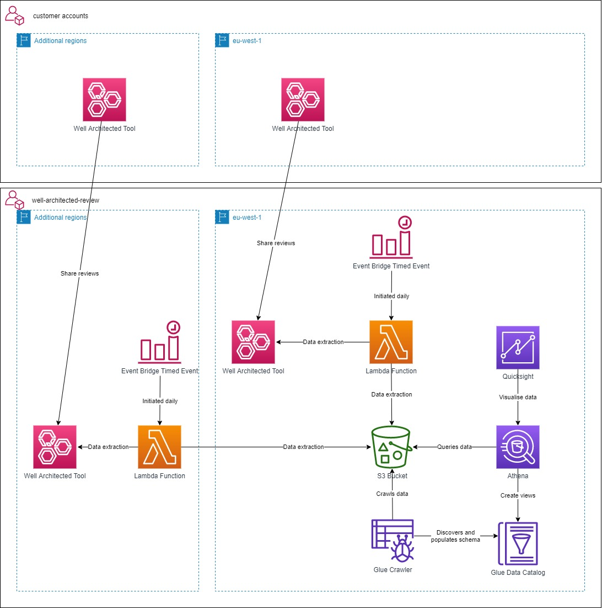
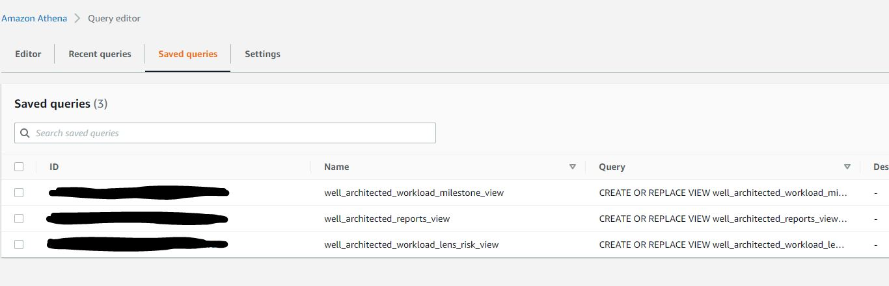

# well-architected-reporting
Account set-up for AWS well architected reviews.  Infrastructure as code created following AWS blog post [here](https://aws.amazon.com/blogs/mt/use-amazon-athena-and-amazon-quicksight-to-build-custom-reports-of-aws-well-architected-reviews/)

Pre-reqs: -
 - AWS Account
 - Log in via CLI via usual chosen method (export VARs, aws configure etc)
 - Complete at least one WAF review and set a milestone
 - terraform

Instructions to deploy central reporting: -
 - cd to well_architected_reporting folder
 - change / set variables within variables.tf as appropriate
 - terraform init
 - terraform plan
 - terraform apply
 - Navigate to Athena console and run the three saved queries
 - 
 - Navigate to and enable Quicksight via the console
 - Create analysis and publish dashboards as appropriate for your use case

 Instructions to add additional regions: -
  - cd to additional_regions folder
  - Ensure the correct regions are listed in regions.txt (Note - do not add the main region to this list)
  - Run the 'deploy-regions.sh' script
